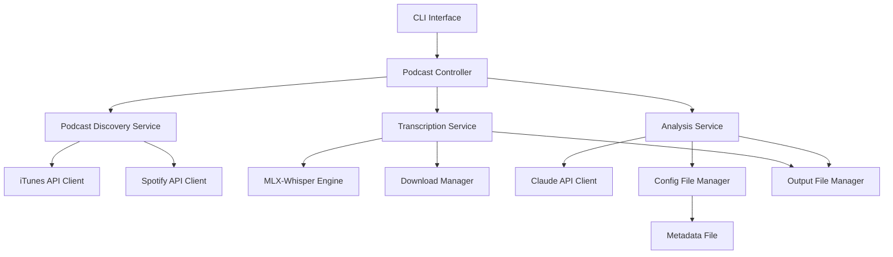

# Design Document

## Overview

PodKnow is a command-line application built with Python 3.13 that provides podcast discovery, transcription, and AI-powered analysis capabilities. The system follows a modular architecture with clear separation between discovery, transcription, and analysis components, optimized for Apple Silicon hardware.

## Architecture

### High-Level Architecture



### Component Responsibilities

- **CLI Interface**: Command parsing, user interaction, and output formatting
- **Podcast Controller**: Orchestrates workflow between discovery, transcription, and analysis
- **Podcast Discovery Service**: Handles podcast search across multiple platforms
- **Transcription Service**: Manages audio download and speech-to-text conversion
- **Analysis Service**: Processes transcriptions using Claude AI
- **Config File Manager**: Handles metadata file parsing and validation

## Components and Interfaces

### 1. CLI Interface

**Purpose**: Provides command-line interface for all user interactions

**Commands**:
- `podknow search <keywords>` - Search for podcasts
- `podknow list <rss_url> [--count N]` - List recent episodes
- `podknow transcribe <episode_id>` - Download and transcribe episode
- `podknow analyze <transcription_file>` - Analyze existing transcription

**Interface**:
```python
class CLIInterface:
    def search_podcasts(self, keywords: str) -> None
    def list_episodes(self, rss_url: str, count: int = 10) -> None
    def transcribe_episode(self, episode_id: str) -> None
    def analyze_transcription(self, file_path: str) -> None
```

### 2. Podcast Discovery Service

**Purpose**: Discovers podcasts across iTunes and Spotify APIs

**Interface**:
```python
class PodcastDiscoveryService:
    def search_itunes(self, query: str) -> List[PodcastResult]
    def search_spotify(self, query: str) -> List[PodcastResult]
    def get_combined_results(self, query: str) -> List[PodcastResult]

@dataclass
class PodcastResult:
    title: str
    author: str
    rss_url: str
    platform: str
    description: str
```

### 3. RSS Feed Parser

**Purpose**: Parses RSS feeds and extracts episode information

**Interface**:
```python
class RSSFeedParser:
    def parse_feed(self, rss_url: str) -> PodcastFeed
    def get_recent_episodes(self, feed: PodcastFeed, count: int) -> List[Episode]

@dataclass
class Episode:
    id: str
    title: str
    description: str
    audio_url: str
    publication_date: datetime
    duration: str
```

### 4. Transcription Service

**Purpose**: Downloads audio and converts to text using MLX-Whisper

**Interface**:
```python
class TranscriptionService:
    def download_audio(self, url: str) -> str  # Returns file path
    def detect_language(self, audio_path: str) -> str
    def transcribe_audio(self, audio_path: str) -> TranscriptionResult
    def cleanup_audio_file(self, audio_path: str) -> None

@dataclass
class TranscriptionResult:
    text: str
    segments: List[TranscriptionSegment]
    language: str
    confidence: float

@dataclass
class TranscriptionSegment:
    start_time: float
    end_time: float
    text: str
    is_paragraph_start: bool
```

### 5. Analysis Service

**Purpose**: Processes transcriptions using Claude AI for content analysis

**Interface**:
```python
class AnalysisService:
    def analyze_transcription(self, transcription: str) -> AnalysisResult
    def generate_summary(self, transcription: str) -> str
    def extract_topics(self, transcription: str) -> List[str]
    def identify_keywords(self, transcription: str) -> List[str]
    def detect_sponsor_content(self, transcription: str) -> List[SponsorSegment]

@dataclass
class AnalysisResult:
    summary: str
    topics: List[str]
    keywords: List[str]
    sponsor_segments: List[SponsorSegment]

@dataclass
class SponsorSegment:
    start_text: str
    end_text: str
    confidence: float
```

### 6. Config File Manager

**Purpose**: Manages metadata file for AI prompts and API configurations

**Interface**:
```python
class ConfigFileManager:
    def load_config(self) -> Config
    def validate_config(self, config: Config) -> bool
    def get_prompt_template(self, prompt_type: str) -> str

@dataclass
class Config:
    claude_api_key: str
    prompts: Dict[str, str]
    analysis_settings: Dict[str, Any]
    output_settings: Dict[str, Any]
```

## Data Models

### Core Data Structures

```python
@dataclass
class PodcastMetadata:
    title: str
    author: str
    description: str
    rss_url: str
    episode_count: int
    last_updated: datetime

@dataclass
class EpisodeMetadata:
    podcast_title: str
    episode_title: str
    episode_number: Optional[int]
    publication_date: datetime
    duration: str
    description: str
    audio_url: str
    file_size: Optional[int]

@dataclass
class OutputDocument:
    metadata: EpisodeMetadata
    transcription: str
    analysis: AnalysisResult
    processing_timestamp: datetime
```

### File Output Format

**Markdown Structure**:
```markdown
---
podcast_title: "Example Podcast"
episode_title: "Episode 123: Topic"
publication_date: "2024-01-15"
duration: "45:30"
transcribed_at: "2024-01-16T10:30:00Z"
language: "en"
keywords: ["keyword1", "keyword2"]
---

# Episode Summary

[AI-generated summary]

## Topics Covered

- Topic 1: Description
- Topic 2: Description

## Transcription

[Paragraph 1 of transcription]

[Paragraph 2 of transcription]

**[SPONSOR CONTENT START]**
[Detected sponsor content]
**[SPONSOR CONTENT END]**

[Continued transcription...]
```

## Error Handling

### Error Categories and Responses

1. **Network Errors**
   - API timeouts, connection failures
   - Retry logic with exponential backoff
   - Graceful degradation for partial results

2. **Audio Processing Errors**
   - Unsupported audio formats
   - Language detection failures
   - MLX-Whisper processing errors

3. **API Errors**
   - Claude API rate limits
   - Authentication failures
   - Invalid response formats

4. **Configuration Errors**
   - Missing or invalid metadata file
   - Malformed configuration syntax
   - Missing required API keys

### Error Handling Strategy

```python
class PodKnowError(Exception):
    """Base exception for PodKnow application"""
    pass

class NetworkError(PodKnowError):
    """Network-related errors"""
    pass

class TranscriptionError(PodKnowError):
    """Audio processing and transcription errors"""
    pass

class AnalysisError(PodKnowError):
    """AI analysis and API errors"""
    pass

class ConfigurationError(PodKnowError):
    """Configuration and setup errors"""
    pass
```

## Testing Strategy

### Unit Testing Approach

- **Component Isolation**: Test each service independently with mocked dependencies
- **API Mocking**: Mock external APIs (iTunes, Spotify, Claude) for reliable testing
- **Audio Processing**: Use sample audio files for transcription testing
- **Configuration Testing**: Test various metadata file configurations

### Integration Testing

- **End-to-End Workflows**: Test complete podcast discovery → transcription → analysis flow
- **API Integration**: Test actual API calls with rate limiting considerations
- **File System Operations**: Test audio download, transcription output, and cleanup

### Test Data Management

- Sample RSS feeds for testing
- Short audio clips in various formats
- Mock API responses for consistent testing
- Configuration file templates for validation testing

## Dependencies and Installation

### Core Dependencies

```python
# Core application
click>=8.0.0          # CLI framework
requests>=2.28.0      # HTTP client
feedparser>=6.0.0     # RSS parsing
pydantic>=2.0.0       # Data validation

# Audio processing
mlx-whisper>=0.1.0    # Apple Silicon optimized Whisper
librosa>=0.10.0       # Audio processing utilities

# AI integration
anthropic>=0.8.0      # Claude API client

# Development
pytest>=7.0.0         # Testing framework
pytest-mock>=3.10.0   # Mocking utilities
black>=23.0.0         # Code formatting
mypy>=1.0.0           # Type checking
```

### Installation Strategy

1. **Virtual Environment Setup**
   ```bash
   python3.13 -m venv podknow-env
   source podknow-env/bin/activate
   ```

2. **Package Installation**
   ```bash
   # Via pip
   pip install -e .
   
   # Via uv (faster alternative)
   uv pip install -e .
   ```

3. **Apple Silicon Optimization**
   - Ensure MLX-Whisper uses Metal Performance Shaders
   - Configure appropriate memory allocation for large audio files
   - Optimize for M-series chip architecture

## Configuration Management

### Metadata File Structure

**Location**: `~/.podknow/config.md`

```markdown
# PodKnow Configuration

## API Keys

```yaml
claude_api_key: "your-claude-api-key"
```

## Analysis Prompts

### Summary Prompt
```
Analyze this podcast transcription and provide a concise summary in 2-3 paragraphs...
```

### Topic Extraction Prompt
```
Extract the main topics discussed in this podcast episode. List each topic in one sentence...
```

### Keyword Identification Prompt
```
Identify relevant keywords and tags for this podcast content...
```

### Sponsor Detection Prompt
```
Identify any sponsored content or advertisements in this transcription...
```

## Output Settings

```yaml
output_directory: "~/Documents/PodKnow"
filename_template: "{podcast_title}_{episode_number}_{date}.md"
include_timestamps: true
paragraph_detection: true
```
```

This configuration approach allows users to customize AI behavior without code changes while maintaining clear separation of concerns.