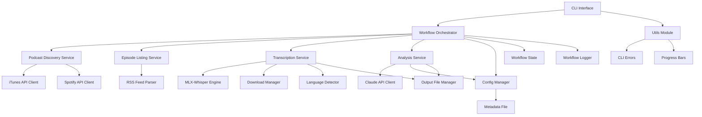

# Design Document

## Overview

PodKnow is a command-line application built with Python 3.13 that provides podcast discovery, transcription, and AI-powered analysis capabilities. The system follows a modular architecture with clear separation between discovery, transcription, and analysis components, optimized for Apple Silicon hardware.

## Architecture

### High-Level Architecture



### Component Responsibilities

- **CLI Interface**: Command parsing, user interaction, output formatting, and global option handling
- **Workflow Orchestrator**: Coordinates multi-step operations with error recovery, state tracking, and resource cleanup
- **Podcast Discovery Service**: Handles podcast search across iTunes and Spotify platforms
- **Episode Listing Service**: Manages RSS feed parsing and episode metadata extraction
- **Transcription Service**: Manages audio download, language detection, and speech-to-text conversion
- **Analysis Service**: Processes transcriptions using Claude AI with configurable prompts
- **Config Manager**: Handles configuration file creation, validation, and status reporting
- **Utils Module**: Provides CLI error handling decorators and progress bar utilities
- **Workflow State**: Tracks execution state, completed/failed steps, and intermediate results
- **Workflow Logger**: Enhanced logging with configurable verbosity and file output

## Components and Interfaces

### 1. CLI Interface

**Purpose**: Provides command-line interface for all user interactions with rich formatting and error handling

**Commands**:
- `podknow search <keywords> [--platform] [--limit]` - Search for podcasts
- `podknow list <rss_url> [--count] [--show-descriptions]` - List recent episodes
- `podknow transcribe <episode_id> --rss-url <url> [--skip-analysis] [--skip-language-detection] [--output-dir]` - Download and transcribe episode
- `podknow analyze <transcription_file> [--output-file]` - Analyze existing transcription
- `podknow setup [--force]` - Create default configuration
- `podknow config-status` - Validate configuration and show status

**Global Options**:
- `--verbose, -v` - Enable verbose debug logging
- `--log-file <path>` - Log to specified file
- `--version` - Show version information

**Interface**:
```python
@click.group()
@click.version_option(version="0.1.0")
@click.option("--verbose", "-v", is_flag=True)
@click.option("--log-file", type=click.Path())
@click.pass_context
def cli(ctx: click.Context, verbose: bool, log_file: Optional[str]):
    """Main CLI entry point with context management"""
    pass

@cli.command()
@click.argument("keywords", required=True)
@click.option("--platform", "-p", type=click.Choice(['itunes', 'spotify', 'all']))
@click.option("--limit", "-l", type=click.IntRange(1, 100))
@click.pass_context
def search(ctx: click.Context, keywords: str, platform: str, limit: int):
    """Search for podcasts"""
    pass

@cli.command()
@click.argument("episode_id", required=True)
@click.option("--rss-url", "-r", required=True)
@click.option("--skip-analysis", is_flag=True)
@click.option("--skip-language-detection", is_flag=True)
@click.option("--output-dir", "-o", type=click.Path())
@click.pass_context
def transcribe(ctx: click.Context, episode_id: str, rss_url: str, ...):
    """Transcribe episode with workflow orchestration"""
    pass
```

### 2. Podcast Discovery Service

**Purpose**: Discovers podcasts across iTunes and Spotify APIs

**Interface**:
```python
class PodcastDiscoveryService:
    def search_itunes(self, query: str) -> List[PodcastResult]
    def search_spotify(self, query: str) -> List[PodcastResult]
    def get_combined_results(self, query: str) -> List[PodcastResult]

@dataclass
class PodcastResult:
    title: str
    author: str
    rss_url: str
    platform: str
    description: str
```

### 3. RSS Feed Parser

**Purpose**: Parses RSS feeds and extracts episode information

**Interface**:
```python
class RSSFeedParser:
    def parse_feed(self, rss_url: str) -> PodcastFeed
    def get_recent_episodes(self, feed: PodcastFeed, count: int) -> List[Episode]

@dataclass
class Episode:
    id: str
    title: str
    description: str
    audio_url: str
    publication_date: datetime
    duration: str
```

### 4. Transcription Service

**Purpose**: Downloads audio and converts to text using MLX-Whisper

**Interface**:
```python
class TranscriptionService:
    def download_audio(self, url: str) -> str  # Returns file path
    def detect_language(self, audio_path: str) -> str
    def transcribe_audio(self, audio_path: str) -> TranscriptionResult
    def cleanup_audio_file(self, audio_path: str) -> None

@dataclass
class TranscriptionResult:
    text: str
    segments: List[TranscriptionSegment]
    language: str
    confidence: float

@dataclass
class TranscriptionSegment:
    start_time: float
    end_time: float
    text: str
    is_paragraph_start: bool
```

### 5. Analysis Service

**Purpose**: Processes transcriptions using Claude AI for content analysis

**Interface**:
```python
class AnalysisService:
    def analyze_transcription(self, transcription: str) -> AnalysisResult
    def generate_summary(self, transcription: str) -> str
    def extract_topics(self, transcription: str) -> List[str]
    def identify_keywords(self, transcription: str) -> List[str]
    def detect_sponsor_content(self, transcription: str) -> List[SponsorSegment]

@dataclass
class AnalysisResult:
    summary: str
    topics: List[str]
    keywords: List[str]
    sponsor_segments: List[SponsorSegment]

@dataclass
class SponsorSegment:
    start_text: str
    end_text: str
    confidence: float
```

### 6. Config Manager

**Purpose**: Manages configuration file creation, validation, and status reporting

**Interface**:
```python
class ConfigManager:
    def __init__(self):
        self.config_path = Path.home() / ".podknow" / "config.md"

    def config_exists(self) -> bool
    def load_config(self) -> Config
    def validate_config(self, config: Config) -> bool
    def create_default_config(self) -> None
    def generate_config_for_first_time_setup(self) -> str
    def get_config_status(self) -> Dict[str, Any]
    def get_prompt_template(self, prompt_type: str) -> str

@dataclass
class Config:
    claude_api_key: str
    spotify_client_id: Optional[str]
    spotify_client_secret: Optional[str]
    prompts: Dict[str, str]
    analysis_settings: Dict[str, Any]
    output_settings: Dict[str, Any]
```

### 7. Workflow Orchestrator

**Purpose**: Coordinates end-to-end workflows with error recovery and state management

**Interface**:
```python
class WorkflowOrchestrator:
    def __init__(self, verbose: bool = False, log_file: Optional[str] = None):
        self.logger = WorkflowLogger(verbose, log_file)
        self._discovery_service = None  # Lazy initialization
        self._episode_service = None
        self._transcription_service = None
        self._analysis_service = None

    def execute_search_workflow(
        self,
        keywords: str,
        platform: str = 'all',
        limit: int = 20
    ) -> List[PodcastResult]

    def execute_episode_listing_workflow(
        self,
        rss_url: str,
        count: int = 10
    ) -> Tuple[PodcastMetadata, List[Episode]]

    def execute_transcription_workflow(
        self,
        episode_id: str,
        rss_url: str,
        output_dir: Optional[str] = None,
        claude_api_key: Optional[str] = None,
        skip_analysis: bool = False,
        skip_language_detection: bool = False,
        language_detection_skip_minutes: float = 2.0
    ) -> str  # Returns output file path

    def execute_analysis_workflow(
        self,
        transcription_file: str,
        claude_api_key: str,
        output_file: Optional[str] = None
    ) -> str

    def get_workflow_status(self) -> Dict[str, Any]

@dataclass
class WorkflowState:
    """Tracks workflow execution state"""
    start_time: datetime
    current_step: str
    completed_steps: List[str]
    failed_steps: List[str]
    errors: List[Tuple[str, Exception]]
    warnings: List[Tuple[str, str]]

    # Intermediate results
    search_results: Optional[List[PodcastResult]]
    selected_episode: Optional[Episode]
    audio_file_path: Optional[str]
    transcription_result: Optional[TranscriptionResult]
    analysis_result: Optional[AnalysisResult]
    output_path: Optional[str]

    def set_step(self, step_name: str) -> None
    def mark_step_failed(self, step_name: str, error: Exception) -> None
    def is_recoverable(self) -> bool
    def get_duration(self) -> float

class WorkflowLogger:
    """Enhanced logging for workflow operations"""
    def __init__(self, verbose: bool = False, log_file: Optional[str] = None):
        self.verbose = verbose
        self.logger = logging.getLogger('podknow.workflow')

    def debug(self, message: str) -> None
    def info(self, message: str) -> None
    def warning(self, message: str) -> None
    def error(self, message: str) -> None
    def progress(self, message: str) -> None
```

### 8. Utils Module

**Purpose**: Provides utility functions for CLI error handling and progress indicators

**Components**:

**CLI Error Handling** (`utils/cli_errors.py`):
```python
def handle_cli_errors(func: Callable) -> Callable:
    """Decorator that catches and formats CLI errors"""
    @functools.wraps(func)
    def wrapper(*args, **kwargs):
        try:
            return func(*args, **kwargs)
        except PodKnowError as e:
            click.echo(f"Error: {e}", err=True)
            sys.exit(1)
        except Exception as e:
            click.echo(f"Unexpected error: {e}", err=True)
            sys.exit(1)
    return wrapper
```

**Progress Context** (`utils/progress.py`):
```python
class ProgressContext:
    """Context manager for suppressing nested progress bars"""
    _suppress_stack: List[bool] = []

    @classmethod
    def suppress(cls) -> ContextManager:
        """Suppress progress bars in nested context"""
        pass

    @classmethod
    def is_suppressed(cls) -> bool:
        """Check if progress bars should be suppressed"""
        pass
```

## Data Models

### Core Data Structures

```python
@dataclass
class PodcastMetadata:
    title: str
    author: str
    description: str
    rss_url: str
    episode_count: int
    last_updated: datetime

@dataclass
class EpisodeMetadata:
    podcast_title: str
    episode_title: str
    episode_number: Optional[int]
    publication_date: datetime
    duration: str
    description: str
    audio_url: str
    file_size: Optional[int]

@dataclass
class OutputDocument:
    metadata: EpisodeMetadata
    transcription: str
    analysis: AnalysisResult
    processing_timestamp: datetime
```

### File Output Format

**Markdown Structure**:
```markdown
---
podcast_title: "Example Podcast"
episode_title: "Episode 123: Topic"
publication_date: "2024-01-15"
duration: "45:30"
transcribed_at: "2024-01-16T10:30:00Z"
language: "en"
keywords: ["keyword1", "keyword2"]
---

# Episode Summary

[AI-generated summary]

## Topics Covered

- Topic 1: Description
- Topic 2: Description

## Transcription

[Paragraph 1 of transcription]

[Paragraph 2 of transcription]

**[SPONSOR CONTENT START]**
[Detected sponsor content]
**[SPONSOR CONTENT END]**

[Continued transcription...]
```

## Error Handling

### Error Categories and Responses

1. **Network Errors**
   - API timeouts, connection failures
   - Retry logic with exponential backoff
   - Graceful degradation for partial results

2. **Audio Processing Errors**
   - Unsupported audio formats
   - Language detection failures
   - MLX-Whisper processing errors

3. **API Errors**
   - Claude API rate limits
   - Authentication failures
   - Invalid response formats

4. **Configuration Errors**
   - Missing or invalid metadata file
   - Malformed configuration syntax
   - Missing required API keys

### Error Handling Strategy

```python
class PodKnowError(Exception):
    """Base exception for PodKnow application"""
    pass

class NetworkError(PodKnowError):
    """Network-related errors"""
    pass

class TranscriptionError(PodKnowError):
    """Audio processing and transcription errors"""
    pass

class AnalysisError(PodKnowError):
    """AI analysis and API errors"""
    pass

class ConfigurationError(PodKnowError):
    """Configuration and setup errors"""
    pass

class AudioProcessingError(PodKnowError):
    """Audio download and processing errors"""
    pass

class LanguageDetectionError(PodKnowError):
    """Language detection errors"""
    pass

class FileOperationError(PodKnowError):
    """File reading, writing, and I/O errors"""
    pass

class EpisodeManagementError(PodKnowError):
    """Episode discovery and management errors"""
    pass
```

### Workflow Error Recovery

The WorkflowOrchestrator implements sophisticated error recovery:

1. **State Tracking**: Maintains WorkflowState with completed/failed steps
2. **Checkpoint Recovery**: Can resume from last successful step
3. **Resource Cleanup**: Automatically cleans up temporary files on failure
4. **Error Context**: Logs detailed error context for debugging
5. **Graceful Degradation**: Continues operation when non-critical steps fail (e.g., analysis can be skipped)

## Testing Strategy

### Unit Testing Approach

- **Component Isolation**: Test each service independently with mocked dependencies
- **API Mocking**: Mock external APIs (iTunes, Spotify, Claude) for reliable testing
- **Audio Processing**: Use sample audio files for transcription testing
- **Configuration Testing**: Test various metadata file configurations

### Integration Testing

- **End-to-End Workflows**: Test complete podcast discovery → transcription → analysis flow
- **API Integration**: Test actual API calls with rate limiting considerations
- **File System Operations**: Test audio download, transcription output, and cleanup

### Test Data Management

- Sample RSS feeds for testing
- Short audio clips in various formats
- Mock API responses for consistent testing
- Configuration file templates for validation testing

## Dependencies and Installation

### Core Dependencies

```python
# Core application
click>=8.0.0          # CLI framework
requests>=2.28.0      # HTTP client
feedparser>=6.0.0     # RSS parsing
pydantic>=2.0.0       # Data validation

# Audio processing (platform-specific)
mlx-whisper>=0.1.0; platform_machine=='arm64'        # Apple Silicon optimized Whisper
openai-whisper>=20231117; platform_machine!='arm64'  # Standard platform Whisper
librosa>=0.10.0       # Audio processing utilities
soundfile>=0.12.0     # Audio file I/O operations

# AI integration
anthropic>=0.8.0      # Claude API client

# Utilities
python-dateutil>=2.8.0  # Date/time parsing
pyyaml>=6.0.0          # YAML configuration parsing
rich>=13.0.0           # Enhanced CLI output and progress bars
tqdm>=4.64.0           # Progress indicators for downloads

# Development
pytest>=7.0.0         # Testing framework
pytest-mock>=3.10.0   # Mocking utilities
pytest-cov>=4.0.0     # Coverage reporting
black>=23.0.0         # Code formatting
mypy>=1.0.0           # Type checking
ruff>=0.1.0           # Fast Python linter
pre-commit>=3.0.0     # Pre-commit hooks
```

### Installation Strategy

1. **Virtual Environment Setup**
   ```bash
   python3.13 -m venv podknow-env
   source podknow-env/bin/activate
   ```

2. **Package Installation**
   ```bash
   # Via pip
   pip install -e .

   # Via uv (faster alternative)
   uv pip install -e .

   # Via Makefile (recommended)
   make install         # Standard pip installation
   make install-uv      # Faster uv installation
   make install-dev     # Development mode with dev dependencies
   ```

3. **First-time Configuration**
   ```bash
   # Create default configuration
   podknow setup

   # Edit configuration file
   nano ~/.podknow/config.md

   # Verify configuration
   podknow config-status
   ```

4. **Platform Detection and Optimization**
   - Automatic platform detection via setup.py
   - Apple Silicon: Installs MLX-Whisper with Metal Performance Shaders
   - Other platforms: Installs OpenAI Whisper with torch backend
   - Check platform: `make check-platform`
   - Verify dependencies: `make verify-deps`

## Configuration Management

### Metadata File Structure

**Location**: `~/.podknow/config.md`

```markdown
# PodKnow Configuration

## API Keys

```yaml
claude_api_key: "your-claude-api-key"
```

## Analysis Prompts

### Summary Prompt
```
Analyze this podcast transcription and provide a concise summary in 2-3 paragraphs...
```

### Topic Extraction Prompt
```
Extract the main topics discussed in this podcast episode. List each topic in one sentence...
```

### Keyword Identification Prompt
```
Identify relevant keywords and tags for this podcast content...
```

### Sponsor Detection Prompt
```
Identify any sponsored content or advertisements in this transcription...
```

## Output Settings

```yaml
output_directory: "~/Documents/PodKnow"
filename_template: "{podcast_title}_{episode_number}_{date}.md"
include_timestamps: true
paragraph_detection: true
```
```

This configuration approach allows users to customize AI behavior without code changes while maintaining clear separation of concerns.