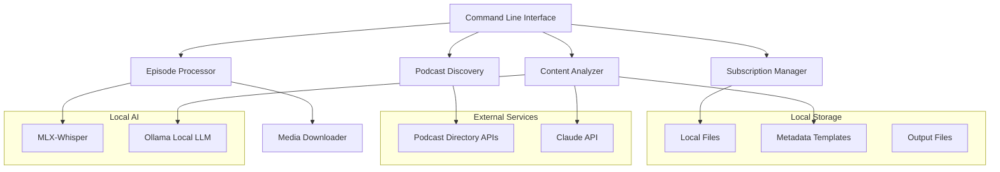

# Design Document

## Overview

PodKnow is architected as a modular Python command-line application with distinct components for podcast discovery, subscription management, media processing, and content analysis. The system emphasizes local data storage, Apple Silicon optimization, and configurable AI integration.

## Architecture



## Components and Interfaces

### Command Line Interface (CLI)
- **Purpose**: Main entry point providing user interaction and command routing
- **Key Methods**:
  - `search_podcasts(query: str) -> List[PodcastResult]`
  - `subscribe(podcast_id: str) -> bool`
  - `process_episodes(podcast_id: Optional[str]) -> None`
  - `list_subscriptions() -> List[Subscription]`

### Podcast Discovery Service
- **Purpose**: Interface with external podcast directories for search functionality
- **Key Methods**:
  - `search_apple_podcasts(query: str) -> List[PodcastResult]`
  - `search_spotify_podcasts(query: str) -> List[PodcastResult]`
  - `get_rss_feed(podcast_url: str) -> RSSFeed`
- **External Dependencies**: Apple Podcasts API, Spotify Web API

### Subscription Manager
- **Purpose**: Local podcast subscription and feed management
- **Key Methods**:
  - `add_subscription(rss_url: str, metadata: PodcastMetadata) -> bool`
  - `remove_subscription(podcast_id: str) -> bool`
  - `get_subscriptions() -> List[Subscription]`
  - `check_for_new_episodes() -> List[Episode]`
- **Storage**: JSON file containing subscription data

### Episode Processor
- **Purpose**: Media download and transcription orchestration
- **Key Methods**:
  - `download_episode(episode_url: str) -> str`
  - `transcribe_audio(file_path: str) -> Transcription`
  - `detect_language(file_path: str) -> str`
- **Dependencies**: MLX-Whisper, requests library, ffmpeg

### Content Analyzer
- **Purpose**: AI-powered content analysis and markdown generation
- **Key Methods**:
  - `generate_summary(transcription: str) -> str`
  - `extract_topics(transcription: str) -> List[Topic]`
  - `identify_keywords(transcription: str) -> List[str]`
  - `load_templates() -> AnalysisTemplates`
- **AI Providers**: Claude API, Ollama local models

### Media Downloader
- **Purpose**: Robust media file downloading with retry logic
- **Key Methods**:
  - `download_with_progress(url: str, destination: str) -> bool`
  - `validate_media_file(file_path: str) -> bool`
  - `get_media_info(file_path: str) -> MediaInfo`

## Data Models

### PodcastResult
```python
@dataclass
class PodcastResult:
    title: str
    author: str
    description: str
    rss_url: str
    artwork_url: Optional[str]
    category: str
```

### Subscription
```python
@dataclass
class Subscription:
    id: str
    title: str
    rss_url: str
    last_checked: datetime
    episode_count: int
    metadata: PodcastMetadata
```

### Episode
```python
@dataclass
class Episode:
    title: str
    description: str
    media_url: str
    publication_date: datetime
    duration: int
    language: str
    podcast_id: str
```

### Transcription
```python
@dataclass
class Transcription:
    text: str
    segments: List[TranscriptionSegment]
    language: str
    confidence: float
    processing_time: float
```

### AnalysisResult
```python
@dataclass
class AnalysisResult:
    summary: str
    topics: List[Topic]
    keywords: List[str]
    metadata: Dict[str, Any]
```

## Error Handling

### Network Errors
- Implement exponential backoff for API calls
- Graceful degradation when podcast directories are unavailable
- Retry logic for media downloads with progress preservation

### Transcription Errors
- Language detection fallback mechanisms
- MLX-Whisper error handling and alternative model selection
- Audio format validation and conversion

### AI Analysis Errors
- Fallback from Claude API to Ollama when API limits reached
- Template validation and error reporting
- Partial analysis completion when some components fail

### File System Errors
- Disk space validation before downloads
- Permission checking for output directories
- Atomic file operations to prevent corruption

## Testing Strategy

### Unit Testing
- Mock external API responses for consistent testing
- Test data model validation and serialization
- Verify error handling paths and edge cases

### Integration Testing
- End-to-end workflow testing with sample RSS feeds
- MLX-Whisper integration testing on Apple Silicon
- AI provider integration testing with rate limiting

### Performance Testing
- Transcription performance benchmarks on different audio lengths
- Memory usage monitoring during large file processing
- Concurrent episode processing validation

## Configuration Management

### Settings File Structure
```yaml
# config.yaml
podcast_directories:
  apple_podcasts:
    enabled: true
    api_key: ${APPLE_PODCASTS_API_KEY}
  spotify:
    enabled: true
    client_id: ${SPOTIFY_CLIENT_ID}
    client_secret: ${SPOTIFY_CLIENT_SECRET}

transcription:
  engine: mlx-whisper
  model: base
  language_detection: true
  english_only: true

ai_analysis:
  primary_provider: claude
  claude:
    api_key: ${CLAUDE_API_KEY}
    model: claude-3-sonnet
  ollama:
    base_url: http://localhost:11434
    model: llama2

storage:
  subscriptions_file: ~/.podknow/subscriptions.json
  output_directory: ~/Documents/PodKnow
  template_directory: ~/.podknow/templates
```

### Template System
- Markdown files containing LLM prompts and instructions
- Jinja2 templating for dynamic content insertion
- Version control friendly configuration format

## Security Considerations

### API Key Management
- Environment variable-based configuration
- Secure storage of authentication credentials
- API rate limiting and quota management

### File System Security
- Sandboxed output directory operations
- Input validation for file paths and URLs
- Safe handling of downloaded media files

### Network Security
- HTTPS-only connections for all external APIs
- Certificate validation for secure communications
- Input sanitization for RSS feed parsing